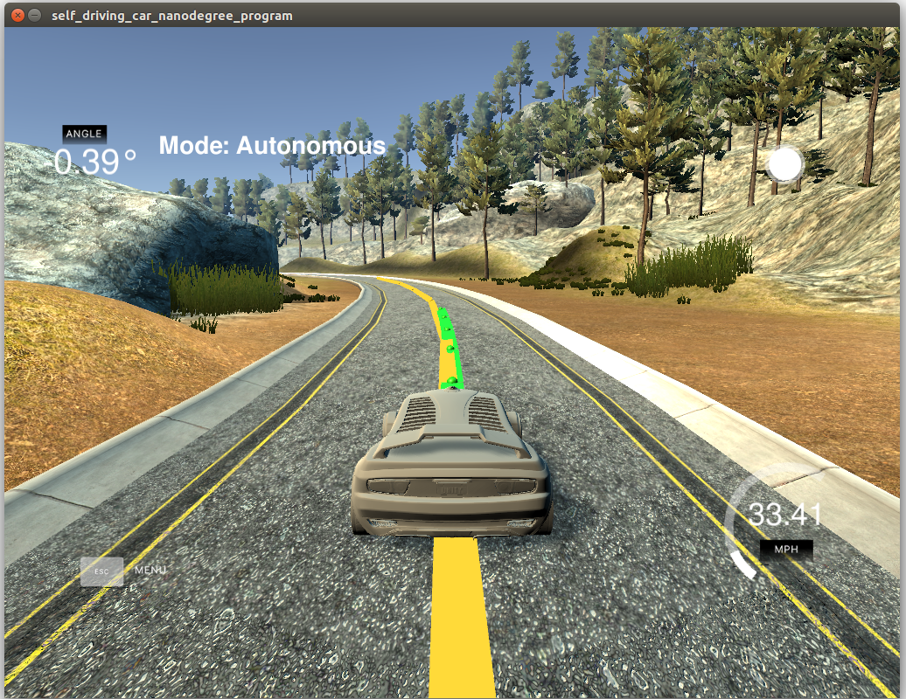

# Model Predictive Control
## Term 2: Project 5 - Udacity Self-driving car nanodegree



## Project description

The project implements a Model Predictive Controller (MPC) to guide a vehicle around a track - which is achieved in a simulator. At each simulator time step, the simulator provides the vehicle position, speed and heading to the MPC controller. Within the MPC, a kinematic model of the vehicle utilises the provided parameters as states, that are dependent on actuators (such as acceleration and steering angle), to predict the future states that are within a prediction horizon. In essence, the states and actuators are classed as design variables, and a non-linear solver (IPOPT in this implementation) varies the design variables, to find the least cost (minimise) of defined equations (such as actual speed vs desired speed, or actual position vs predicted position etc), with the design variables being constrained within certain bounds.

## Usage

A script titled `ez-build.sh` is included in the repository for compilation and testing. Alternatively, the user may enter the following commands:
* `mkdir build && cd build`
* `cmake .. && make`
* `./mpc`

Once built, the Udacity Simulator v1.45 was utilised.

## Response to rubric requirements
### Compiling
* Requirement: Code should compile without errors with `cmake` and `make`
* Response: Code compiles without error, as testing with the minimum dependancy requirements.

### Implementation
* Criteria: The model should be described in detail, including state, actuators and update equations.

Response: In this model, the kinematic model of the vehicle is utilised. Therefore, this model ignores the tire forces, gravity and mass that a dynamic model would utilise. Therefore, there are four states for the kinematic model: x-position `px`, y-position `py`, vehicle velocity angle `psi` and vehicle velocity `v`. 

In terms of the actuators, there are essentially 3 actuators - however the throttle and break are treated as a single actuator, with the positive and negative value indicating acceleration and deceleration respectively `acc` , and the other actuator is the steering angle `delta`.

The update equations allow for the state and actuators at time=t, to predict the state of the vehicle at the next time=(t+1). In addition, the cross-track error `cte` and orientation error `epsi` are also included in the update step. The general update equations are found in `FG_eval` class in `MPC.cpp` lines 107-113, and the core update equations are as follows:
* `px(t+1) = px(t) + v(t) * cos(psi(t)) * dt`
* `py(t+1) = py(t) + v(t) * sin(psi(t)) * dt`
* `psi(t+1) = psi + v / Lf * delta * dt`
* `v(t+1) =  v(t) + acc(t) * dt`
* `cte(t+1) = cte(t) + v(t) * sin(desired_psi(t) * dt`
* `desired_psi(t+1) = desired_psi(t) + v(t) / Lf * delta * dt`

where `Lf` is the distance between the front of the vehicle and its centre of gravity.

* Criteria: Timestep length `N` and elapsed duration `dt`, and the reasoning behind the variable choices should be discussed, as well as previous attempted values.

Response: Without any latency considerations, I could set `dt` = 0.05s and `N` = 20, and achieve good results for a speed of 60mph. However, introducing latency resulted in having to increase `dt` to 0.15s and decrease `N` to 8 - I also had to reduce the reference speed to 35mph, to avoid oscillations - even when considering the update to the state equations to include latency.

* Criteria: Polynominal fitting and MPC preprocessing should be discussed.

Response: At each time step, the waypoints of the desired vehicle path trajectory are converted from global coordinates to vehicle coordinates by the function `transformWaypoints`. The coefficients of a 3rd order polynomial line are then estimated based on the transformed waypoints using `polyfit`, and then the cross-track error is calculated using `polyeval` and orientation error is calculated based on the derivative of the 3rd order coefficients, and the associated `px` position. These values are then passed as a state vector to MPC.

* Criteria: Model predictive control with latency should include 100ms latency and details on how this was dealt with.

Response: To incorporate latency, I included some preprocessing steps before the waypoint transformation. I read in the steering_angle and the throttle, and assumed that the acceleration is equal to the throttle. Essentially, the preprocessing utilises the latency time of 100ms, to predict the vehicle position, heading and speed after the latency period. The preprocessing is done in `main.cpp` lines 118 - 120. The update equations that I included for latency are as follows:
* `px(t+0.1) = px(t) + v(t) * cos(psi(t)) * latency`
* `py(t+0.1) = py(t) + v(t) * sin(psi(t)) * latency`
* `psi(t+0.1) = psi - v / Lf * delta * latency, (included negative sign for simulator left/right sign convention)`
* `v(t+0.1) =  v(t) + acc(t) * latency`

### Simulation
* Criteria: The vehicle must successfully drive a lap around the track.

Response: The vehicle successfully drives around the track.

---

## Dependencies (Based on original Git fork)

* cmake >= 3.5
 * All OSes: [click here for installation instructions](https://cmake.org/install/)
* make >= 4.1
  * Linux: make is installed by default on most Linux distros
  * Mac: [install Xcode command line tools to get make](https://developer.apple.com/xcode/features/)
  * Windows: [Click here for installation instructions](http://gnuwin32.sourceforge.net/packages/make.htm)
* gcc/g++ >= 5.4
  * Linux: gcc / g++ is installed by default on most Linux distros
  * Mac: same deal as make - [install Xcode command line tools]((https://developer.apple.com/xcode/features/)
  * Windows: recommend using [MinGW](http://www.mingw.org/)
* [uWebSockets](https://github.com/uWebSockets/uWebSockets)
  * Run either `install-mac.sh` or `install-ubuntu.sh`.
  * If you install from source, checkout to commit `e94b6e1`, i.e.
    ```
    git clone https://github.com/uWebSockets/uWebSockets 
    cd uWebSockets
    git checkout e94b6e1
    ```
    Some function signatures have changed in v0.14.x. See [this PR](https://github.com/udacity/CarND-MPC-Project/pull/3) for more details.
* Fortran Compiler
  * Mac: `brew install gcc` (might not be required)
  * Linux: `sudo apt-get install gfortran`. Additionall you have also have to install gcc and g++, `sudo apt-get install gcc g++`. Look in [this Dockerfile](https://github.com/udacity/CarND-MPC-Quizzes/blob/master/Dockerfile) for more info.
* [Ipopt](https://projects.coin-or.org/Ipopt)
  * Mac: `brew install ipopt`
  * Linux
    * You will need a version of Ipopt 3.12.1 or higher. The version available through `apt-get` is 3.11.x. If you can get that version to work great but if not there's a script `install_ipopt.sh` that will install Ipopt. You just need to download the source from the Ipopt [releases page](https://www.coin-or.org/download/source/Ipopt/) or the [Github releases](https://github.com/coin-or/Ipopt/releases) page.
    * Then call `install_ipopt.sh` with the source directory as the first argument, ex: `bash install_ipopt.sh Ipopt-3.12.1`. 
  * Windows: TODO. If you can use the Linux subsystem and follow the Linux instructions.
* [CppAD](https://www.coin-or.org/CppAD/)
  * Mac: `brew install cppad`
  * Linux `sudo apt-get install cppad` or equivalent.
  * Windows: TODO. If you can use the Linux subsystem and follow the Linux instructions.
* [Eigen](http://eigen.tuxfamily.org/index.php?title=Main_Page). This is already part of the repo so you shouldn't have to worry about it.
* Simulator. You can download these from the [releases tab](https://github.com/udacity/self-driving-car-sim/releases).
* Not a dependency but read the [DATA.md](./DATA.md) for a description of the data sent back from the simulator.
